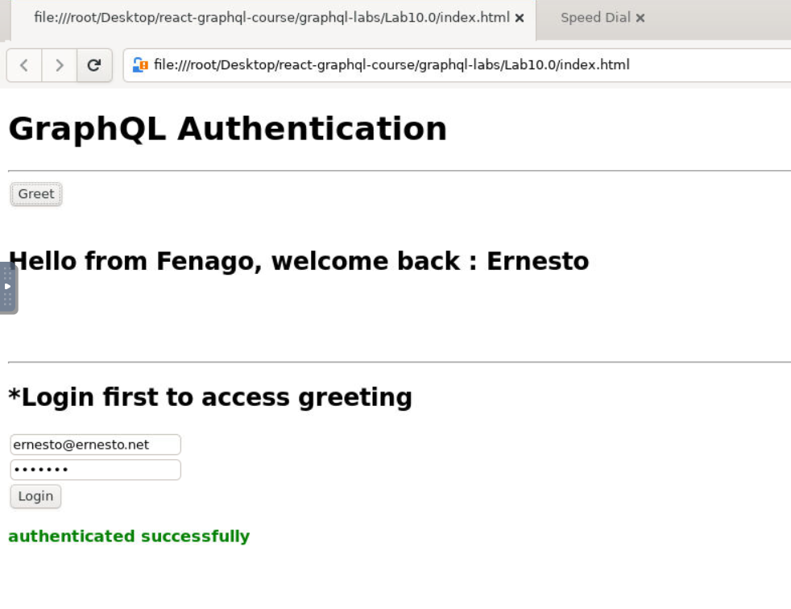

#### Lab 10.0: GraphQL - Authenticating Client


Authentication is the process or action of verifying the identity of a
user or a process. It is important that an application authenticates a
user to ensure that the data is not available to an anonymous user. In
this section, we will learn how to authenticate a GraphQL client.

Express JWT
-----------

In this example, we will use jQuery to create a client application. To
authenticate requests, we will use **express-jwt** module on the
server-side.

The express-jwt module is a middleware that lets you authenticate HTTP
requests using JWT tokens. JSON Web Token (JWT) is a long string that
identifies the logged in user.

Once the user logs in successfully, the server generates a JWT token.
This token distinctly identifies a log. In other words, the token is a
representation of user\'s identity. So next time, when the client comes
to the server, it has to present this token to get the required
resources. The client can be either a mobile application or a web
application.


Illustration
------------

We will follow a step-wise procedure to understand this illustration.

Setting up the Server
---------------------

Following are the steps for setting up the server −

### Step 1 − Download and Install Required Dependencies for the Project

Create a folder **auth-server-app**. Change your directory
to **auth-server-app** from the terminal. Follow steps 3 to 5 explained
in the Environment Setup lab.

Step 2 − Create a Schema
------------------------

Add **schema.graphql** file in the project
folder **auth-server-app** and add the following code −

```
type Query
{
   greetingWithAuth:String
}
```

### Step 3 − Add Resolvers

Create a file **resolvers.js** in the project folder and add the
following code −

The resolver will verify if an authenticated user object is available in
the context object of GraphQL. It will raise an exception if an
authenticated user is not available.

```
const db = require('./db')

const Query = {
   greetingWithAuth:(root,args,context,info) => {

      //check if the context.user is null
      if (!context.user) {
         throw new Error('Unauthorized');
      }
      return "Hello from Fenago, welcome back : "+context.user.firstName;
   }
}

module.exports = {Query}
```

### Step 4 − Create Server.js File

The authentication middleware authenticates callers using a JSON Web
Token. The URL for authentication is **http://localhost:9000/login**.

This is a post operation. The user has to submit his email and password
which will be validated from the backend. If a valid token is generated
using jwt.sign method, the client will have to send this in header for
subsequent requests.

If the token is valid, req.user will be set with the JSON object decoded
to be used by later middleware for authorization and access control.

The following code uses two modules − jsonwebtoken and express-jwt to
authenticate requests −

-   When the user clicks on the **greet** button, a request for the
    /graphql route is issued. If the user is not authenticated, he will
    be prompted to authenticate himself.

-   The user is presented with a form that accepts email id and
    password. In our example, the /login route is responsible for
    authenticating the user.

-   The /login route verifies if a match is found in the database for
    credentials provided by the user.

-   If the credentials are invalid, a HTTP 401 exception is returned to
    the user.

-   If the credentials are valid, a token is generated by the server.
    This token is sent as a part of response to the user. This is done
    by the jwt.sign function.

```
const expressJwt = require('express-jwt');
const jwt = require('jsonwebtoken');

//private key
const jwtSecret = Buffer.from('Zn8Q5tyZ/G1MHltc4F/gTkVJMlrbKiZt', 'base64');

app.post('/login', (req, res) => {
   const {email, password} = req.body;
   
   //check database
   const user = db.students.list().find((user) =>  user.email === email);
   if (!(user && user.password === password)) {
      res.sendStatus(401);
      return;
   }
   
   //generate a token based on private key, token doesn't have an expiry
   const token = jwt.sign({sub: user.id}, jwtSecret);
   res.send({token});
});
```

For every request, the app.use() function will be called. This in turn
will invoke the expressJWT middleware. This middleware will decode the
JSON Web Token. The user id stored in the token will be retrieved and
stored as a property user in the request object.

```
//decodes the JWT and stores in request object
app.use(expressJwt({
   secret: jwtSecret,
   credentialsRequired: false
}));
```

To make available the user property within GraphQL context, this
property is assigned to the **context** object as shown below −

```
//Make req.user available to GraphQL context
app.use('/graphql', graphqlExpress((req) => ({
   schema,
   context: {user: req.user &&apm; db.students.get(req.user.sub)}
})));
```

Create **server.js** in current folder path. The complete server.js file
is as follows −

```
const bodyParser = require('body-parser');
const cors = require('cors');
const express = require('express');
const expressJwt = require('express-jwt'); //auth
const jwt = require('jsonwebtoken'); //auth
const db = require('./db');

var port = process.env.PORT || 9000
const jwtSecret = Buffer.from('Zn8Q5tyZ/G1MHltc4F/gTkVJMlrbKiZt', 'base64');
const app = express();

const fs = require('fs')
const typeDefs = fs.readFileSync('./schema.graphql',{encoding:'utf-8'})
const resolvers = require('./resolvers')
const {makeExecutableSchema} = require('graphql-tools')

const schema = makeExecutableSchema({typeDefs, resolvers})

app.use(cors(), bodyParser.json(), expressJwt({
   secret: jwtSecret,
   credentialsRequired: false
}));

const  {graphiqlExpress,graphqlExpress} = require('apollo-server-express')

app.use('/graphql', graphqlExpress((req) => ({
   schema,
   context: {user: req.user && db.students.get(req.user.sub)}
})));
app.use('/graphiql',graphiqlExpress({endpointURL:'/graphql'}))

//authenticate students
app.post('/login', (req, res) => {
   const email = req.body.email;
   const password = req.body.password;

   const user = db.students.list().find((user) =>  user.email === email);
   if (!(user && user.password === password)) {
      res.sendStatus(401);
      return;
   }
   const token = jwt.sign({sub: user.id}, jwtSecret);
   res.send({token});
});

app.listen(port, () => console.info(`Server started on port ${port}`));
```
Note - you may need to add this to server.js:
in the server.js : 
```
app.use(cors(), bodyParser.json(), expressJwt({
    secret: jwtSecret,
    credentialsRequired: false,
    algorithms: ['HS256']
}));
```
### Step 5 − Run the Application

Execute the command *npm* start in the terminal. The server will be up
and running on 9000 port. Here, we use GraphiQL as a client to test the
application.

Open browser and type the URL **http://localhost:9000/graphiql**. Type
the following query in the editor −

```
{
   greetingWithAuth
}
```

In the below response, we got an error as we are not authenticated user.

```
{
   "data": {
      "greetingWithAuth": null
   },
   "errors": [
      {
         "message": "Unauthorized",
         "locations": [
            {
               "line": 2,
               "column": 3
            }
         ],
         "path": [
            "greetingWithAuth"
         ]
      }
   ]
}
```

In the next section, let us create a client application to authenticate.

Setting up the JQuery Client
----------------------------

In the client application, a greet button is provided which will invoke
the schema **greetingWithAuth**. If you click the button without login,
it will give you the error message as below −


Once you log in with a user available in database, the following screen
will appear −



To access **greeting**, we need to first access the URL
**http://localhost:9000/login** route as below.

The response will contain the token generated from the server.

```
$.ajax({
   url:"http://localhost:9000/login",
   contentType:"application/json",
   type:"POST",
   data:JSON.stringify({email,password}),
   success:function(response) {
      loginToken = response.token;
      $('#authStatus')
      .html("authenticated successfully")
      .css({"color":"green",'font-weight':'bold'});
      $("#greetingDiv").html('').css({'color':''});
   },
   error:(xhr,err) =>  alert('error')
})
```

After a successful login, we can access *greetingWithAuth* schema as
given below. There should be an Authorizationheader for all the
subsequent requests with bearer token.

```
{ 
   url: "http://localhost:9000/graphql",
   contentType: "application/json",
   headers: {"Authorization": 'bearer '+loginToken},  type:'POST',
   data: JSON.stringify({
   query:`{greetingWithAuth}`
}
```

The following is the code for index.html −

```
<!DOCTYPE html>
<html>
   <head>
      <script src = "https://ajax.googleapis.com/ajax/libs/jquery/3.3.1/jquery.min.js"></script>
      <script>
         $(document).ready(function() {
            let loginToken = "";
            $("#btnGreet").click(function() {
                  $.ajax({url: "http://localhost:9000/graphql",
                  contentType: "application/json",
                  headers: {"Authorization": 'bearer '+loginToken},
                  type:'POST',
                  data: JSON.stringify({
                  query:`{greetingWithAuth}` }),
                  success: function(result) {
                  $("#greetingDiv").html("<h1>"+result.data.greetingWithAuth+"</h1>")
                  },
                  error:function(jQxhr,error) {
                     if(jQxhr.status == 401) {
                        $("#greetingDiv").html('please authenticate first!!')
                        .css({"color":"red",'font-weight':'bold'})
                        return;
                     }
                     $("#greetingDiv").html('error').css("color","red");
                  }
               });
            });
            $('#btnAuthenticate').click(function() {
               var email =  $("#txtEmail").val();
               var password =  $("#txtPwd").val();
               if(email && password) {
                  $.ajax({
                     url:"http://localhost:9000/login",
                     contentType:"application/json",
                     type:"POST",
                     data:JSON.stringify({email,password}),
                     success:function(response) {
                        loginToken =  response.token;
                        $('#authStatus')
                        .html("authenticated successfully")
                        .css({"color":"green",'font-weight':'bold'});
                        $("#greetingDiv").html('').css({'color':''});
                     },
                     error:(xhr,err) =>  alert('error')
                  })
               }else alert("email and pwd empty")
            })
         });
      </script>
   </head>
   
   <body>
      <h1> GraphQL Authentication </h1>
      <hr/>
      <section>
         <button id = "btnGreet">Greet</button>
         <br/> <br/>
         <div id = "greetingDiv"></div>
      </section>
      <br/> <br/> <br/>
      <hr/>
      
      <section id = "LoginSection">
         <header>
            <h2>*Login first to  access greeting </h2>
         </header>
         <input type = "text" value = "mohtashim.mohammad@fenago.org" placeholder = "enter email" id = "txtEmail"/>
         <br/>
         
         <input type = "password" value = "pass123" placeholder = "enter password" id = "txtPwd"/>
         <br/>
         
         <input type = "button" id = "btnAuthenticate"  value = "Login"/>
         <p id = "authStatus"></p>
      </section>
   </body>
</html>
```

