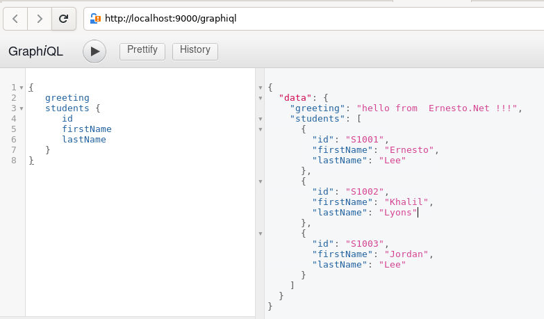

Lab 3.0: Create a Schema to Query the Server
======================================


We will create a simple API that returns a greeting message, HelloWorld, and access it using GraphiQL.

Hint:  Use VSCode for all exercises because it supports copy and paste in the containerized environment.

**Note:** 

- VSCode is already installed in the lab environment, you can open solution folder in vscode.
- Use Midori browser installed in the lab environment for accessing application.


Schemas and Servers
==================================
We will create a simple application to understand the schema. This will create a schema for querying a list of students from the server. The student data will be stored in a flat file and we will use a node module called notarealdb to fake a database and read from the flat file.  Remember, GraphQL is DB agnostic.

## Step 1 − Download and Install Required Dependencies for the Project
Create a folder named schema-app. Change your directory to schema-app from the terminal. Then, follow steps 3 to 5 explained in Lab1.0 to complete the download and the installation process.

## Step 2 − Create a Schema
Add **schema.graphql** file in the project folder, schema-app and add the following code −

```json
type Query {
   greeting:String
   students:[Student]
}

type Student {
   id:ID!
   firstName:String
   lastName:String
   password:String
   collegeId:String
}
```
The root of the schema will be Query type. The query has two fields − greeting and Students that returns String and a list of students respectively. Student is declared as an Object type since it contains multiple fields. The ID field is declared as non-nullable.

## Step 3 − Create Resolver
Create a file **resolvers.js** in the project folder and add the following code −

```javascript
const db = require('./db')
const Query = {
   greeting:() => {
      return "hello from  Ernesto.Net !!!"
   },
   students:() => db.students.list()
}

module.exports = {Query}
```
Here greeting and students are the resolvers that handle the query. students resolver function returns a list of students from the data access layer. To access resolver functions outside the module, Query object has to be exported using module.exports.

## Step 4 − Run the Application

Create a **server.js** file and add following code:

```
const bodyParser = require('body-parser');
const cors = require('cors');
const express = require('express');
const db = require('./db');

const port = process.env.PORT || 9000;
const app = express();

const fs = require('fs')
const typeDefs = fs.readFileSync('./schema.graphql',{encoding:'utf-8'})
const resolvers = require('./resolvers')

const {makeExecutableSchema} = require('graphql-tools')
const schema = makeExecutableSchema({typeDefs, resolvers})

app.use(cors(), bodyParser.json());

const  {graphiqlExpress,graphqlExpress} = require('apollo-server-express')
app.use('/graphql',graphqlExpress({schema}))
app.use('/graphiql',graphiqlExpress({endpointURL:'/graphql'}))

app.listen(
   port, () => console.info(
      `Server started on port ${port}`
   )
);
```

## Solution Structure 
Copy package.json, db.js and the data directory from `Lab1.0` folder. Verify the folder structure of project as follows:

```
└── schema-app
    ├── data
    │   ├── colleges.json
    │   └── students.json
    ├── db.js
    ├── package.json
    ├── resolvers.js
    ├── schema.graphql
    └── server.js
```


The next step is to execute the command npm start in the terminal. The server will be up and running on 9000 port. Here, we use GraphiQL as a client to test the application. Open browser and type the URL, http://localhost:9000/graphiql.

Type the following query in the editor −

```javascript
{
   greeting
   students {
      id
      firstName
      lastName
   }
}
```
The query will display the output as shown below −

