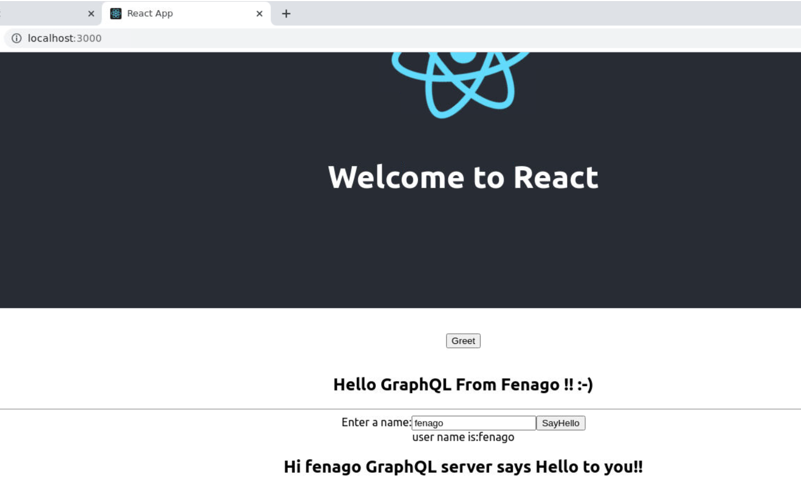

#### Lab 8.0: GraphQL - React Integration


React is a Javascript library for building user interfaces. This lab
explains how one can integrate GraphQL with a React application.

Illustration
------------

The quickest way to set up a react project is by using the *Create React
App* tool. In the subsequent sections, we will learn how to set up both
the Server and the Client.

Setting up the Server
---------------------

For setting up the Server, follow the below steps −

### Step 1 − Download and Install Required Dependencies for the Project

Create a folder **react-server-app**. Change your directory
to **react-server-app** from the terminal. Follow steps 3 to 5 explained
in the Environment Setup lab.

### Step 2 − Create a Schema

Add **schema.graphql** file in the project
folder **react-server-app** and add the following code −

``` {.prettyprint .notranslate .prettyprinted style=""}
type Query
{
   greeting: String
   sayHello(name:String!):String
}
```

The file has defined two queries -- greeting and sayHello.
The sayHello query accepts a string parameter and returns another
string. The parameter to the sayHello() function is not null.

### Step 3 − Create Resolvers

Create a file **resolvers.js** in the project folder and add the
following code −

``` {.prettyprint .notranslate .prettyprinted style=""}
const Query =
{
   greeting: () => 'Hello GraphQL  From Fenago !!' ,
   sayHello:(root,args,context,info) =>  `Hi ${args.name} GraphQL server says Hello to you!!`
}
module.exports = {Query}
```

Here greeting and sayHello are two resolvers. In the sayHello resolver,
the value passed to the name parameter can be accessed through args. To
access resolver functions outside the module, Query object has to be
exported using module.exports.

### Step 4 − Run the Application

Create a server.js file. Refer step 8 in the Environment Setup Lab.
Execute the command *npm start* in the terminal. The server will be up
and running on 9000 port. Here, we use GraphiQL as a client to test the
application.

Open browser and type the URL **http://localhost:9000/graphiql**. Type
the following query in the editor −

``` {.prettyprint .notranslate .prettyprinted style=""}
{
   greeting,
   sayHello(name:"Mohtashim")
}
```

The response from the server is given below −

``` {.prettyprint .notranslate .prettyprinted style=""}
{
   "data": {
      "greeting": "Hello GraphQL  From Fenago !!",
      "sayHello": "Hi Mohtashim GraphQL server says Hello to you!!"
   }
}
```

Setting up the Client
---------------------

Open a new terminal for client. The server terminal should be kept
running before executing the client application. React application will
be running on port number 3000 and server application on port number
9000.

### Step 1 − Create a React Project hello-world-client

In the client terminal, type the following command −

``` {.result .notranslate}
npx create-react-app hello-world-client
```

This will install everything needed for a typical react application. The
**npx** utility and **create-react-app** tool create a project with name
hello-world-client. Once the installation is completed, open the project
in VSCode.

### Step 2 − Start hello-world-client

Change the current folder path in the terminal to hello-world-client.
Type npm start to launch the project. This will run a development server
at port 3000 and will automatically open the browser and load the index
page.

This is shown in the screenshot given below −


### Step 3 − Modify the App Component

In the App.js inside src folder, add two functions, one to load greeting
and another to load sayHello messages.

Following is the loadGreeting function which sends GraphQL query for
greeting.

``` {.prettyprint .notranslate .prettyprinted style=""}
async function loadGreeting() {
   const response = await fetch('http://localhost:9000/graphql', {
      method:'POST',

      headers:{'content-type':'application/json'},
      body:JSON.stringify({query:'{greeting}'})
   })

   const rsponseBody = await response.json();
   return rsponseBody.data.greeting;

   console.log("end of function")
}
```

Following is the **loadSayhello** function which sends GraphQL query
for sayHello −

``` {.prettyprint .notranslate .prettyprinted style=""}
async function  loadSayhello(name) {
   const response = await fetch('http://localhost:9000/graphql', {
      method:'POST',
      headers:{'content-type':'application/json'},
      body:JSON.stringify({query:`{sayHello(name:"${name}")}`})
   })
}
```

The complete **App.js** file is shown below −

``` {.prettyprint .notranslate .prettyprinted style=""}
import React, { Component } from 'react';
import logo from './logo.svg';
import './App.css';

async function loadGreeting() {
   const response =  await fetch('http://localhost:9000/graphql', {
      method:'POST',
      headers:{'content-type':'application/json'},
      body:JSON.stringify({query:'{greeting}'})
   })
   const rsponseBody =  await response.json();
   return rsponseBody.data.greeting;
   console.log("end of function")
}

async function  loadSayhello(name) {
   const response =  await fetch('http://localhost:9000/graphql', {
      method:'POST',
      headers:{'content-type':'application/json'},
      body:JSON.stringify({query:`{sayHello(name:"${name}")}`})
   })
   const rsponseBody =  await response.json();
   return rsponseBody.data.sayHello;
}

class App extends Component {
   constructor(props) {
      super(props);
      this.state =  {greetingMessage:'',sayHelloMessage:'',userName:''}
      this.updateName =  this.updateName.bind(this);
      this.showSayHelloMessage =  this.showSayHelloMessage.bind(this);
      this.showGreeting =  this.showGreeting.bind(this);
   }
   
   showGreeting() {
      loadGreeting().then(g => this.setState({greetingMessage:g+" :-)"}))
   }
   
   showSayHelloMessage() {
      const name = this.state.userName;
      console.log(name)
      loadSayhello(name).then(m => this.setState({sayHelloMessage:m}))
   }
   
   updateName(event) {
      this.setState({userName:event.target.value})
   }
   render() {
      return (
         <div className = "App">
            <header className = "App-header">
               
               <h1 className = "App-title">Welcome to React</h1>
            </header>
            <br/><br/>
            <section>
               <button id = "btnGreet" onClick = {this.showGreeting}>Greet</button>
               <br/> <br/>
               <div id = "greetingDiv">
                  <h1>{this.state.greetingMessage}</h1>
               </div>
            </section>
            
            <hr/>
            
            <section>
               Enter a name:<input id = "txtName" type = "text" onChange = {this.updateName}
               value = {this.state.userName}/>
               <button id = "btnSayhello" onClick = {this.showSayHelloMessage}>SayHello</button>
               <br/>
               user name is:{this.state.userName}    <br/>
               <div id = "SayhelloDiv">
                  <h1>{this.state.sayHelloMessage}</h1>
               </div>
            </section>
         </div>
      );
   }
}

export default App;
```

Once both the applications are running, click on the greet button. Next,
enter a name in the textbox and click on sayHello button. The output
will be as given below −



