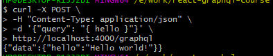
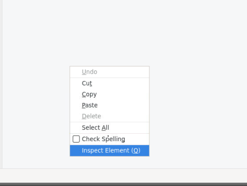
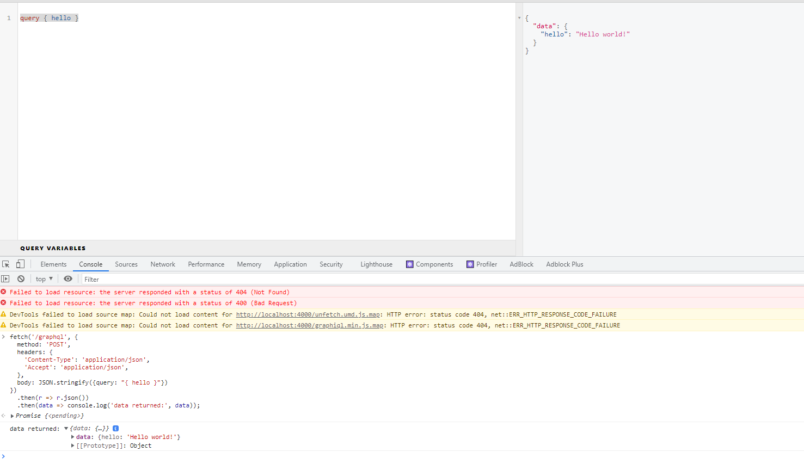

### Lab 3:  GraphQL Clients

With express-graphql, you can just send an HTTP POST request to the endpoint you mounted your GraphQL server on, passing the GraphQL query as the query field in a JSON payload.

**Note:** Keep graphQL server running started in Lab2.

For example, let's say we mounted a GraphQL server on http://localhost:4000/graphql as in the example code for running an Express GraphQL server, and we want to send the GraphQL query { hello }. We can do this from the command line with curl. If you paste this into a terminal:

**Do this:**

```
curl -X POST \
-H "Content-Type: application/json" \
-d '{"query": "{ hello }"}' \
http://localhost:4000/graphql
```

You should see the output returned as JSON:

**Do this:**

`{"data":{"hello":"Hello world!"}}`



If you prefer to use a graphical user interface to send a test query, you can use clients such as GraphiQL and Insomnia.

It's also simple to send GraphQL from the browser. Open up http://localhost:4000/graphql, open a developer console:

**Do this: (Use FireFox Developer Console)**

1. Right click on GraphiQL page inside Firefox and select `Inspect Element`:


2. By default, Firefox does not allow you to paste stuff into the dev tools console. You have to manually type "allow paste" into the console to enable pasting. 

3. Copy and paste following snippet in the firefox console:

```
fetch('/graphql', {
  method: 'POST',
  headers: {
    'Content-Type': 'application/json',
    'Accept': 'application/json',
  },
  body: JSON.stringify({query: "{ hello }"})
})
  .then(r => r.json())
  .then(data => console.log('data returned:', data));
```

You should see the data returned, logged in the console:

**Do this:**

data returned: Object `{ hello: "Hello world!" }`



In this example, the query was just a hardcoded string. As your application becomes more complex, and you add GraphQL endpoints that take arguments as described in **Lab 5** (Passing Arguments), you will want to construct GraphQL queries using variables in client code. You can do this by including a keyword prefixed with a dollar sign in the query, and passing an extra variables field on the payload.
