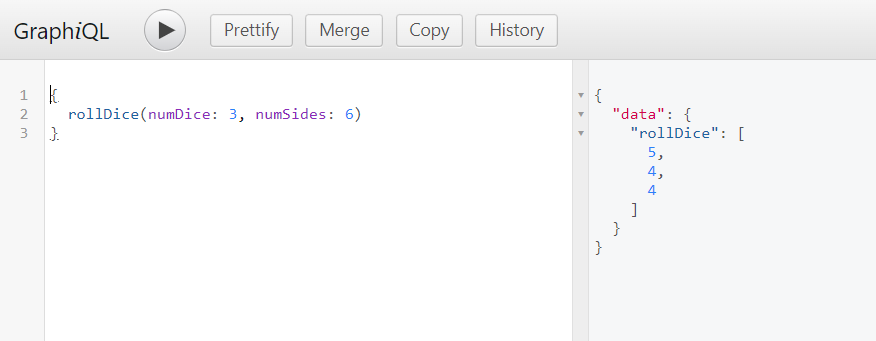

### Lab 5:  Passing Arguments

**Lab Solution** Solution is present in `Lab5` directory.

Just like a REST API, it's common to pass arguments to an endpoint in a GraphQL API. By defining the arguments in the schema language, typechecking happens automatically. Each argument must be named and have a type. For example, in the Basic Types documentation we had an endpoint called rollThreeDice:

**Do this:**

```
type Query {
  rollThreeDice: [Int]
}
```

Instead of hardcoding "three", we might want a more general function that rolls numDice dice, each of which have numSides sides. We can add arguments to the GraphQL schema language like this:

**Do this:**

```
type Query {
  rollDice(numDice: Int!, numSides: Int): [Int]
}
```

The exclamation point in Int! indicates that numDice can't be null, which means we can skip a bit of validation logic to make our server code simpler. We can let numSides be null and assume that by default a die has 6 sides.

So far, our resolver functions took no arguments. When a resolver takes arguments, they are passed as one "args" object, as the first argument to the function. So rollDice could be implemented as:

**Do this:**

```
var root = {
  rollDice: (args) => {
    var output = [];
    for (var i = 0; i < args.numDice; i++) {
      output.push(1 + Math.floor(Math.random() * (args.numSides || 6)));
    }
    return output;
  }
};

```

It's convenient to use ES6 destructuring assignment for these parameters, since you know what format they will be. So we can also write rollDice as

**Do this:**

```
var root = {
  rollDice: ({numDice, numSides}) => {
    var output = [];
    for (var i = 0; i < numDice; i++) {
      output.push(1 + Math.floor(Math.random() * (numSides || 6)));
    }
    return output;
  }
};

```

If you're familiar with destructuring, this is a bit nicer because the line of code where rollDice is defined tells you about what the arguments are.

The entire code for a server that hosts this rollDice API is:

**Do this:**

```javascript
var express = require('express');
var { graphqlHTTP } = require('express-graphql');
var { buildSchema } = require('graphql');

// Construct a schema, using GraphQL schema language
var schema = buildSchema(`
  type Query {
    rollDice(numDice: Int!, numSides: Int): [Int]
  }
`);

// The root provides a resolver function for each API endpoint
var root = {
  rollDice: ({numDice, numSides}) => {
    var output = [];
    for (var i = 0; i < numDice; i++) {
      output.push(1 + Math.floor(Math.random() * (numSides || 6)));
    }
    return output;
  }
};

var app = express();
app.use('/graphql', graphqlHTTP({
  schema: schema,
  rootValue: root,
  graphiql: true,
}));
app.listen(4000);
console.log('Running a GraphQL API server at localhost:4000/graphql');

```

When you call this API, you have to pass each argument by name. So for the server above, you could issue this GraphQL query to roll three six-sided dice:

**Do this:**

```
{
  rollDice(numDice: 3, numSides: 6)
}
```

If you run this code with node server.js and browse to http://localhost:4000/graphql you can try out this API.



When you're passing arguments in code, it's generally better to avoid constructing the whole query string yourself. Instead, you can use $ syntax to define variables in your query, and pass the variables as a separate map.

For example, some JavaScript code that calls our server above is:

**Do this: (Use Firefox)** 

```
var dice = 3;
var sides = 6;
var query = `query RollDice($dice: Int!, $sides: Int) {
  rollDice(numDice: $dice, numSides: $sides)
}`;
fetch('/graphql', {
  method: 'POST',
  headers: {
    'Content-Type': 'application/json',
    'Accept': 'application/json',
  },
  body: JSON.stringify({
    query,
    variables: { dice, sides },
  })
})
  .then(r => r.json())
  .then(data => console.log('data returned:', data));

```


Using $dice and $sides as variables in GraphQL means we don't have to worry about escaping on the client side.

With basic types and argument passing, you can implement anything you can implement in a REST API. But GraphQL supports even more powerful queries. You can replace multiple API calls with a single API call if you learn how to define your own object types.
