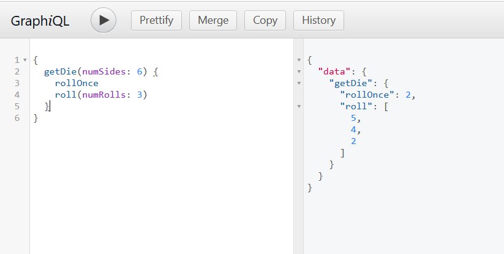

### Lab 6:  Object Types

**Lab Solution** Solution is present in `Lab6` directory. Run `npm install` before running solution.

In GraphQL schema language, the way you define a new object type is the same way we have been defining the Query type in our examples. Each object can have fields that return a particular type, and methods that take arguments. For example, in the Passing Arguments documentation, we had a method to roll some random dice:

**Do this:**

```
type Query {
  rollDice(numDice: Int!, numSides: Int): [Int]
}
```

If we wanted to have more and more methods based on a random die over time, we could implement this with a RandomDie object type instead.

**Do this:**

```
type RandomDie {
  roll(numRolls: Int!): [Int]
}

type Query {
  getDie(numSides: Int): RandomDie
}
```

Instead of a root-level resolver for the RandomDie type, we can instead use an ES6 class, where the resolvers are instance methods. This code shows how the RandomDie schema above can be implemented:

**Do this:**

```
class RandomDie {
  constructor(numSides) {
    this.numSides = numSides;
  }

  rollOnce() {
    return 1 + Math.floor(Math.random() * this.numSides);
  }

  roll({numRolls}) {
    var output = [];
    for (var i = 0; i < numRolls; i++) {
      output.push(this.rollOnce());
    }
    return output;
  }
}

var root = {
  getDie: ({numSides}) => {
    return new RandomDie(numSides || 6);
  }
}

```

For fields that don't use any arguments, you can use either properties on the object or instance methods. So for the example code above, both numSides and rollOnce can actually be used to implement GraphQL fields, so that code also implements the schema of:

**Do this:**

```
type RandomDie {
  numSides: Int!
  rollOnce: Int!
  roll(numRolls: Int!): [Int]
}

type Query {
  getDie(numSides: Int): RandomDie
}
```

Putting this all together, here is some sample code that runs a server with this GraphQL API:

**Do this:**

```javascript
var express = require('express');
var { graphqlHTTP } = require('express-graphql');
var { buildSchema } = require('graphql');

// Construct a schema, using GraphQL schema language
var schema = buildSchema(`
  type RandomDie {
    numSides: Int!
    rollOnce: Int!
    roll(numRolls: Int!): [Int]
  }

  type Query {
    getDie(numSides: Int): RandomDie
  }
`);

// This class implements the RandomDie GraphQL type
class RandomDie {
  constructor(numSides) {
    this.numSides = numSides;
  }

  rollOnce() {
    return 1 + Math.floor(Math.random() * this.numSides);
  }

  roll({numRolls}) {
    var output = [];
    for (var i = 0; i < numRolls; i++) {
      output.push(this.rollOnce());
    }
    return output;
  }
}

// The root provides the top-level API endpoints
var root = {
  getDie: ({numSides}) => {
    return new RandomDie(numSides || 6);
  }
}

var app = express();
app.use('/graphql', graphqlHTTP({
  schema: schema,
  rootValue: root,
  graphiql: true,
}));
app.listen(4000);
console.log('Running a GraphQL API server at localhost:4000/graphql');

```

When you issue a GraphQL query against an API that returns object types, you can call multiple methods on the object at once by nesting the GraphQL field names. For example, if you wanted to call both rollOnce to roll a die once, and roll to roll a die three times, you could do it with this query:


**Do this:**

```
{
  getDie(numSides: 6) {
    rollOnce
    roll(numRolls: 3)
  }
}
```

If you run this code with node server.js and browse to http://localhost:4000/graphql you can try out these APIs with GraphiQL.



This way of defining object types often provides advantages over a traditional REST API. Instead of doing one API request to get basic information about an object, and then multiple subsequent API requests to find out more information about that object, you can get all of that information in one API request. That saves bandwidth, makes your app run faster, and simplifies your client-side logic.

