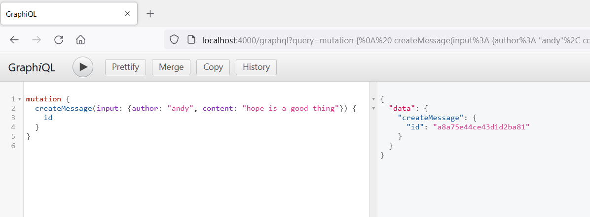
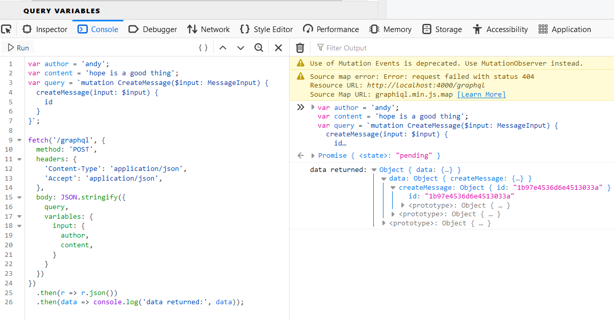

### Lab 7:  Mutations and Input Types

**Lab Solution** Solution is present in `Lab7` directory. Run `npm install` before running solution.

If you have an API endpoint that alters data, like inserting data into a database or altering data already in a database, you should make this endpoint a Mutation rather than a Query. This is as simple as making the API endpoint part of the top-level Mutation type instead of the top-level Query type.

Let's say we have a "message of the day" server, where anyone can update the message of the day, and anyone can read the current one. The GraphQL schema for this is simply:

**Do this:**

```
type Mutation {
  setMessage(message: String): String
}

type Query {
  getMessage: String
}

```

It's often convenient to have a mutation that maps to a database create or update operation, like setMessage, return the same thing that the server stored. That way, if you modify the data on the server, the client can learn about those modifications.

Both mutations and queries can be handled by root resolvers, so the root that implements this schema can simply be:

**Do this:**

```
var fakeDatabase = {};
var root = {
  setMessage: ({message}) => {
    fakeDatabase.message = message;
    return message;
  },
  getMessage: () => {
    return fakeDatabase.message;
  }
};
```

You don't need anything more than this to implement mutations. But in many cases, you will find a number of different mutations that all accept the same input parameters. A common example is that creating an object in a database and updating an object in a database often take the same parameters. To make your schema simpler, you can use "input types" for this, by using the input keyword instead of the type keyword.

For example, instead of a single message of the day, let's say we have many messages, indexed in a database by the id field, and each message has both a content string and an author string. We want a mutation API both for creating a new message and for updating an old message. We could use the schema:

**Do this:**

```
input MessageInput {
  content: String
  author: String
}

type Message {
  id: ID!
  content: String
  author: String
}

type Query {
  getMessage(id: ID!): Message
}

type Mutation {
  createMessage(input: MessageInput): Message
  updateMessage(id: ID!, input: MessageInput): Message
}
```

Here, the mutations return a Message type, so that the client can get more information about the newly-modified Message in the same request as the request that mutates it.

Input types can't have fields that are other objects, only basic scalar types, list types, and other input types.

Naming input types with Input on the end is a useful convention, because you will often want both an input type and an output type that are slightly different for a single conceptual object.

Here's some runnable code that implements this schema, keeping the data in memory:

**Do this:**

```javascript
var express = require('express');
var { graphqlHTTP } = require('express-graphql');
var { buildSchema } = require('graphql');

// Construct a schema, using GraphQL schema language
var schema = buildSchema(`
  input MessageInput {
    content: String
    author: String
  }

  type Message {
    id: ID!
    content: String
    author: String
  }

  type Query {
    getMessage(id: ID!): Message
  }

  type Mutation {
    createMessage(input: MessageInput): Message
    updateMessage(id: ID!, input: MessageInput): Message
  }
`);

// If Message had any complex fields, we'd put them on this object.
class Message {
  constructor(id, {content, author}) {
    this.id = id;
    this.content = content;
    this.author = author;
  }
}

// Maps username to content
var fakeDatabase = {};

var root = {
  getMessage: ({id}) => {
    if (!fakeDatabase[id]) {
      throw new Error('no message exists with id ' + id);
    }
    return new Message(id, fakeDatabase[id]);
  },
  createMessage: ({input}) => {
    // Create a random id for our "database".
    var id = require('crypto').randomBytes(10).toString('hex');

    fakeDatabase[id] = input;
    return new Message(id, input);
  },
  updateMessage: ({id, input}) => {
    if (!fakeDatabase[id]) {
      throw new Error('no message exists with id ' + id);
    }
    // This replaces all old data, but some apps might want partial update.
    fakeDatabase[id] = input;
    return new Message(id, input);
  },
};

var app = express();
app.use('/graphql', graphqlHTTP({
  schema: schema,
  rootValue: root,
  graphiql: true,
}));
app.listen(4000, () => {
  console.log('Running a GraphQL API server at localhost:4000/graphql');
});
```

To call a mutation, you must use the keyword mutation before your GraphQL query. To pass an input type, provide the data written as if it's a JSON object. For example, with the server defined above, you can create a new message and return the id of the new message with this operation:

**Do this:**

```
mutation {
  createMessage(input: {
    author: "andy",
    content: "hope is a good thing",
  }) {
    id
  }
}
```



You can use variables to simplify mutation client logic just like you can with queries. For example, some JavaScript code that calls the server to execute this mutation is:

**Do this:**

1. Right Click inside Firefox and Select `Inspect Element`:


2. Copy and paste following snippet in the firefox console:

```
var author = 'andy';
var content = 'hope is a good thing';
var query = `mutation CreateMessage($input: MessageInput) {
  createMessage(input: $input) {
    id
  }
}`;

fetch('/graphql', {
  method: 'POST',
  headers: {
    'Content-Type': 'application/json',
    'Accept': 'application/json',
  },
  body: JSON.stringify({
    query,
    variables: {
      input: {
        author,
        content,
      }
    }
  })
})
  .then(r => r.json())
  .then(data => console.log('data returned:', data));
```



One particular type of mutation is operations that change users, like signing up a new user. While you can implement this using GraphQL mutations, you can reuse many existing libraries if you learn about GraphQL with authentication and Express middleware.


