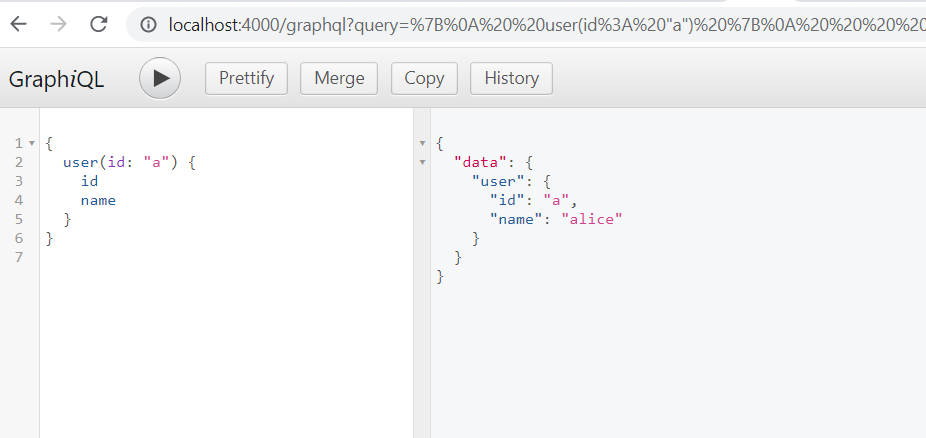
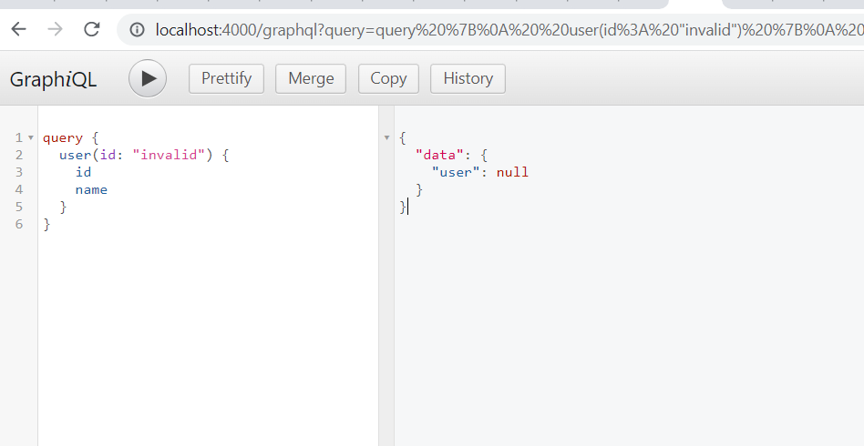

### Lab 9:  Constructing Types

For many apps, you can define a fixed schema when the application starts, and define it using GraphQL schema language. In some cases, it's useful to construct a schema programmatically. You can do this using the GraphQLSchema constructor.

When you are using the GraphQLSchema constructor to create a schema, instead of defining Query and Mutation types solely using schema language, you create them as separate object types.

**Lab Solution** Solution is present in `Lab9` directory. Run `npm install` before running solution.

For example, let's say we are building a simple API that lets you fetch user data for a few hardcoded users based on an id. Using buildSchema we could write a server with:

**Do this:**

```javascript
var express = require('express');
var { graphqlHTTP } = require('express-graphql');
var { buildSchema } = require('graphql');

var schema = buildSchema(`
  type User {
    id: String
    name: String
  }

  type Query {
    user(id: String): User
  }
`);

// Maps id to User object
var fakeDatabase = {
  'a': {
    id: 'a',
    name: 'alice',
  },
  'b': {
    id: 'b',
    name: 'bob',
  },
};

var root = {
  user: ({id}) => {
    return fakeDatabase[id];
  }
};

var app = express();
app.use('/graphql', graphqlHTTP({
  schema: schema,
  rootValue: root,
  graphiql: true,
}));
app.listen(4000);
console.log('Running a GraphQL API server at localhost:4000/graphql');
```

**Run Query**

```
{
  user(id: "a") {
    id
    name
  }
}
```




```
{
  user(id: "invalid") {
    id
    name
  }
}
```




We can implement this same API without using GraphQL schema language:

**Lab Solution** Solution is present in `Lab9-2` directory. Run `npm install` before running solution.

**Do this:**

```javascript
var express = require('express');
var { graphqlHTTP } = require('express-graphql');
var graphql = require('graphql');

// Maps id to User object
var fakeDatabase = {
  'a': {
    id: 'a',
    name: 'alice',
  },
  'b': {
    id: 'b',
    name: 'bob',
  },
};

// Define the User type
var userType = new graphql.GraphQLObjectType({
  name: 'User',
  fields: {
    id: { type: graphql.GraphQLString },
    name: { type: graphql.GraphQLString },
  }
});

// Define the Query type
var queryType = new graphql.GraphQLObjectType({
  name: 'Query',
  fields: {
    user: {
      type: userType,
      // `args` describes the arguments that the `user` query accepts
      args: {
        id: { type: graphql.GraphQLString }
      },
      resolve: (_, {id}) => {
        return fakeDatabase[id];
      }
    }
  }
});

var schema = new graphql.GraphQLSchema({query: queryType});

var app = express();
app.use('/graphql', graphqlHTTP({
  schema: schema,
  graphiql: true,
}));
app.listen(4000);
console.log('Running a GraphQL API server at localhost:4000/graphql');
```

**Note:** Run queries we ran earlier, you should get same response.

When we use this method of creating the API, the root level resolvers are implemented on the Query and Mutation types rather than on a root object.

This is particularly useful if you want to create a GraphQL schema automatically from something else, like a database schema. You might have a common format for something like creating and updating database records. This is also useful for implementing features like union types which don't map cleanly to ES6 classes and schema language.
